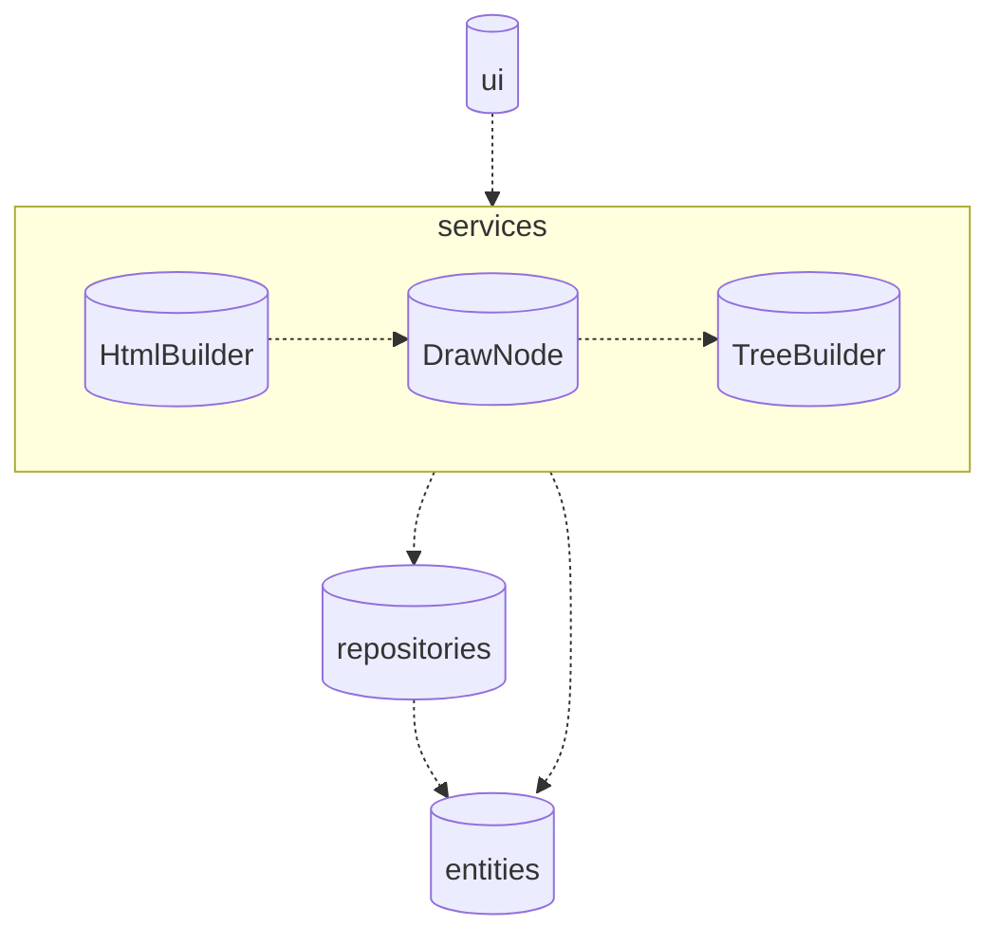
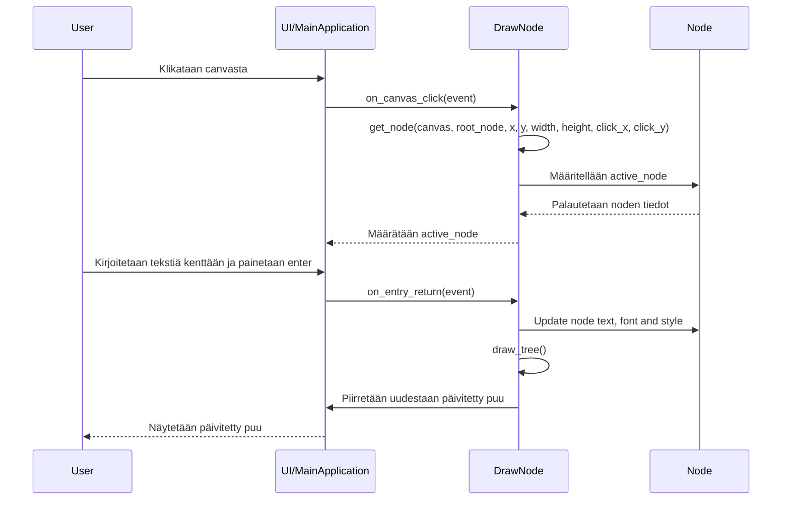

## Rakenne

Koodin pakkausrakenne näyttää tältä:

- Pakkaus _ui_ sisältää käyttöliittymästä vastaavat luokat, eli käyttäjälle näkyvän sovelluksen osan.
- Pakkaus _services_ tarjoaa sovelluslogiikan, jota käyttöliittymä käyttää.
- Pakkaus _repositories_ sisältää tietojen pysyväistallennuksesta vastaavat luokat.
- Pakkaus _entities_ sisältää sovelluksen datamalleista vastaavat luokat.

### Sovelluslogiikka

- Luokka [DrawNode](/src/services/draw_node.py) kuvaa solmun eli div-elementin piirtämistä.
- Luokka [TreeBuilder](/src/services/tree_builder.py) kuvaa puun rakentamista eli layoutin luomista.
- Luokka [HtmlBuilder](/src/services/html_builder.py) kuvaa puun muuntamista html-tiedostoksi. 

### Päätoiminnallisuudet

#### Käyttäjä kirjoittaa tekstiä

- Käyttäjä klikkaa jotakin solmua canvaksella: DrawNode-luokassa käynnistyy on_canvas_click-tapahtumankäsittelijä.
- Määritellään aktiivinen solmu: Klikkauksen sijainnin perusteella DrawNode saa selville aktiivisen solmun get_node-metodilla.
- Päivitetään solmun tiedot: Kun käyttäjä kirjoittaa tekstiä ja painaa enter, kutsutaan on_entry_return-metodia, joka päivittää aktiivisen solmun tiedot.
- Piirretään puu uudelleen: Puu piirretään aina uudelleen päivitetyillä tiedoilla.
