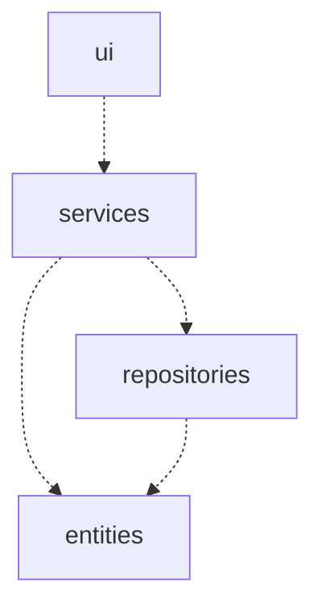

## Rakenne

Koodin pakkausrakenne näyttää tältä:

- Pakkaus _ui_ sisältää käyttöliittymästä vastaavat luokat, eli käyttäjälle näkyvän sovelluksen osan.
- Pakkaus _services_ tarjoaa sovelluslogiikan, jota käyttöliittymä käyttää.
- Pakkaus _repositories_ sisältää tietojen pysyväistallennuksesta vastaavat luokat.
- Pakkaus _entities_ sisältää sovelluksen datamalleista vastaavat luokat.

