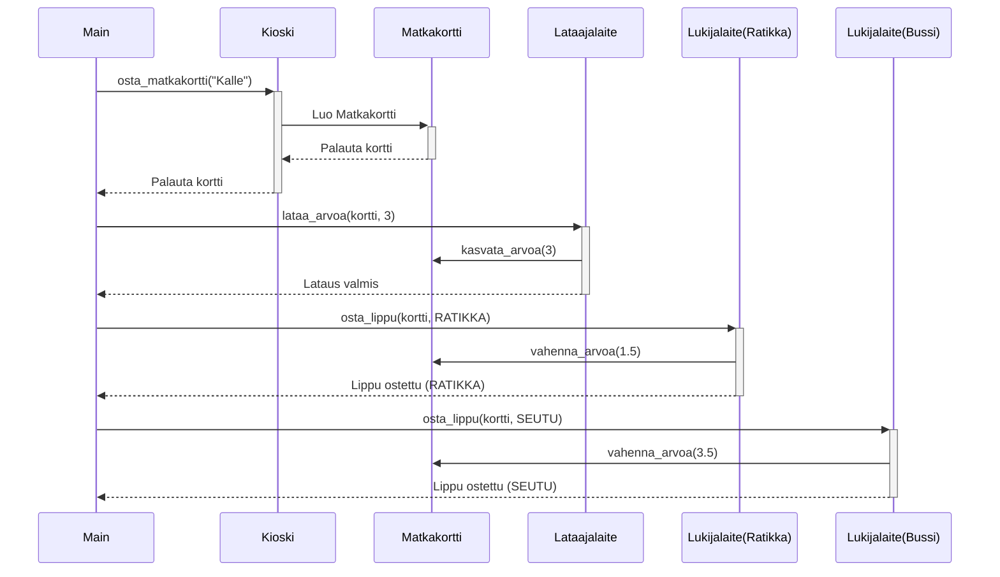

```mermaid
sequenceDiagram
    participant M as Main
    participant K as Kioski
    participant MK as Matkakortti
    participant L1 as Lataajalaite
    participant L2 as Lukijalaite(Ratikka)
    participant L3 as Lukijalaite(Bussi)

    M->>+K: osta_matkakortti("Kalle")
    K->>+MK: Luo Matkakortti
    MK-->>-K: Palauta kortti
    K-->>-M: Palauta kortti
    M->>+L1: lataa_arvoa(kortti, 3)
    L1->>MK: kasvata_arvoa(3)
    L1-->>-M: Lataus valmis
    M->>+L2: osta_lippu(kortti, RATIKKA)
    L2->>MK: vahenna_arvoa(1.5)
    L2-->>-M: Lippu ostettu (RATIKKA)
    M->>+L3: osta_lippu(kortti, SEUTU)
    L3->>MK: vahenna_arvoa(3.5)
    L3-->>-M: Lippu ostettu (SEUTU)
```
